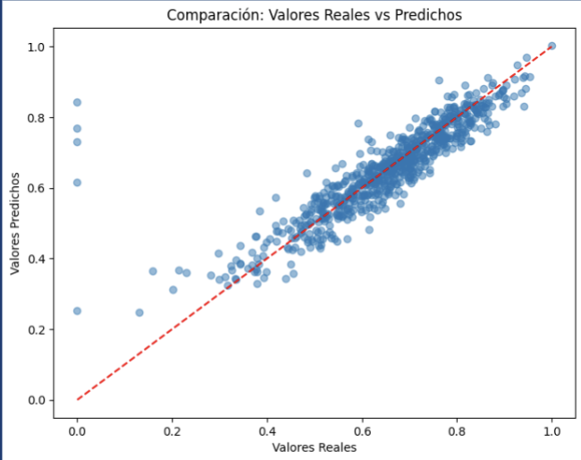

 
  
  # Predicting poverty indicators in Mexico
  
  
  
  
  
  

  

This repository contains an end-to-end analysis of poverty indicators using data-driven techniques. The project includes:

- Exploratory Data Analysis (EDA)
- Feature selecrtion and data Transformation
- Hyperparameter tuning for model optimization

The goal is to extract meaningful insights from socio-economic data and optimize predictive models to better understand poverty trends and classifications.
The dataset used in this project was created by merging open data sources from the 2020 Population and Housing Census by INEGI and the 2020 Multidimensional Poverty Measurement by CONEVAL. Preprocessing steps were applied to ensure data quality and consistency.

Experimented with various models, including:
- Lineal Methods (Linear Regression, Bayesian Ridge,
Ridge)
- Tree-based models: Decision Tree, Random Forest, XGBoost, Gradient Boosting, AdaBoost
- Support Vector Regression (SVR)
- Artificial Neural Networks (MLP Regressor)

The best-performing model was Neural Networks (MLP Regressor), which outperformed other models in predictive accuracy.

